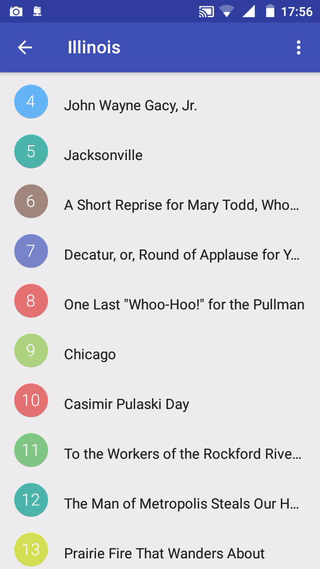
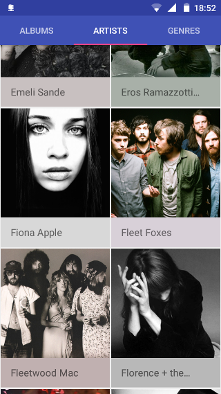
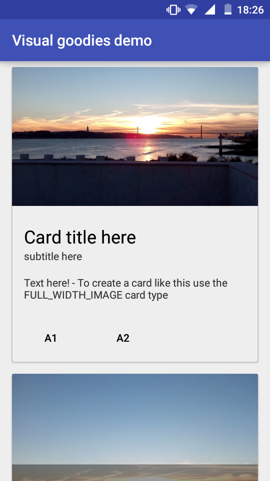
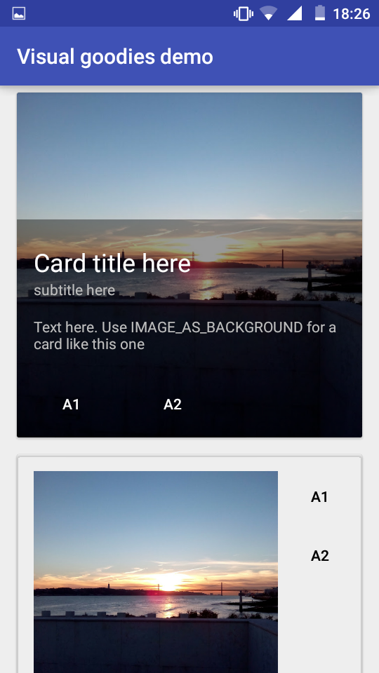
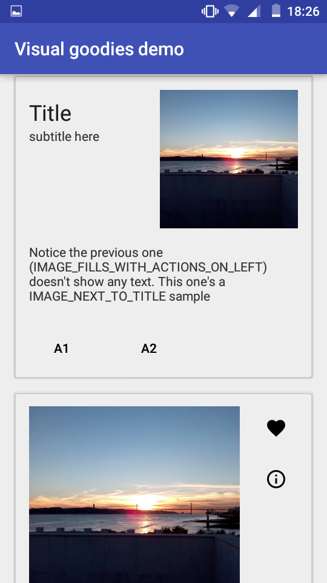
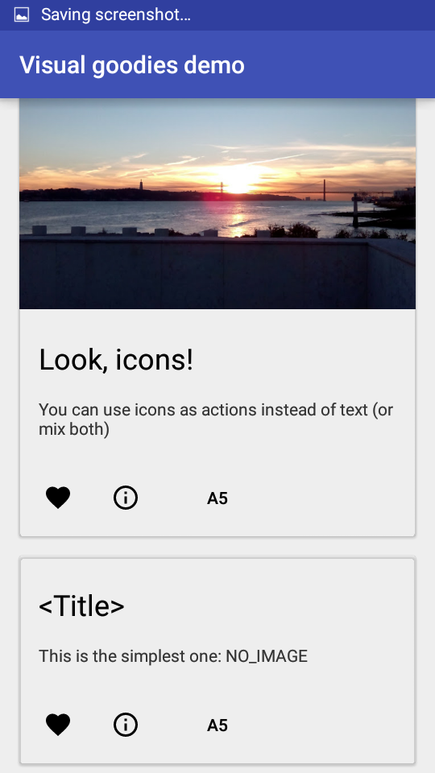

[](http://android-arsenal.com/details/1/4100)

The purpose of this library is to provide an easy way to implement some of the the eye-candy lists/cards/and some other widgets Google demonstrates on the Material Design Guidelines.
Checkout some of the features below.

## Lists
The goal was to mimic the lists (and Grids) shown at [Google's Material Design guidelines](https://www.google.com/design/spec/components/lists.html#lists-specs) (or hybrids of them) with just a few lines of code:
```java
ListAdapter mAdapter = new ListAdapter(){
    //Use GridAdapter if you need a grid (or an hybrid)
    @Override
    public String getSubHeaderText(int i) {/*If you have subheaders, text'd go here*/}

    @Override
    public int getNumItems(){/*Number of list items go here*/}

    @Override
    public void bindDataToListItem(int i, View view, ImageView imageView, ImageButton
            imageButton, TextView... textViews) {
        //Here you actually compose the list item
        //i is the index
        //view is the item's view
        //imageView is an image (the one at the left)
        //imageButton same (at the right)
        //textViews are the textfields, from top to bottom, left to right
        //These will depend on the method below
    }

    @Override
    public ListItemType getListItemDataType(int i) {/*return the list item at index i's type*/}
```
#### Also you can:
* add an header view (```listAdapter.addHeaderView(view)```)
* add dividers between the list items (``` listAdapter.setDividerStyle(DividerStyle.JUST_SUB_HEADERS)```, other options are only above dividers, or none (default)). You'll need to set their color: (```listAdapter.setDividerColor(Divider.MATERIAL_LIGHT_DIVIDER_COLOR)```, or ```MATERIAL_DARK_DIVIDER_COLOR```)
* add click/long click listener (```listAdapter.setOnItemClickListener(new OnItemClickListener(){ ... })```)
* Turn the avatars/buttons into checkboxes (```listAdapter.setShowCheckboxes(true)```)
* Same as above but in an ActionMode (```startSupportActionMode(new ListAdapter.ListCheckingActionMode(listAdapter)```)
* Make the adapter to display a view when the list is empty (```listAdapter.setEmptyView(view)```)

#### Example:
|  |  |

## RecyclerViewFragment
It's basically a fragment with a RecyclerView. Just extend this class, override onViewCreated, and then you can access these methods (even if you don't use this library's adapters):
* ```setAdapter(adapter)```
* ```setEmptyText(text)```, ```setEmptyView(view)```
* ```setOnItemClickListener(listener)```, ```setOnItemLongClickListener(listener)```
* suggestions are welcome!

## Dialogs
Instead of playing with ```AlertDialog.Builder``` class each time you need a dialog...
* Create a simple message dialog with a one-liner:```MessageDialog.show(getActivity(), "title here", "hey what\'s up?")```
* Ask confirmation: ```MessageDialog.askConfirmation(getActivity(), "title here", "msg here", new DialogInterface.OnClickListener(){...})```
* A number within a range ```new NumberPickerDialog(getActivity(), Integer.MIN_VALUE, Integer.MAX_VALUE).show(new NumberPickerDialog.NumberPickerListener() {...}```
* Text that fits some parameters:
```java
new TextInputDialog(getActivity()).setInputPolicy(new TextInputDialog.InputPolicy() {
    @Override
    public String isTextAcceptable(String s) {
        if (s.equals("asdfghjkl"))
            return "what?"; //what the user wrote is not okay
        return null; //What the user wrote is fine
    }
}).show(new TextInputDialog.TextListener() {
    @Override
    public void onTextAccepted(String s) {
        //isTextAcceptable(s) returned null and the user accepted
    }
});
```

## CardBuilder
The intent is to create a Card like the ones at [Google's MD guidelines](https://www.google.com/design/spec/components/cards.html) with just a few lines (and not having to create layout files)

[Check the demo project](/demo/src/main/java/com/alexive/graphicalutils/demo/CardsActivity.java) for a complete sample on how to use the CardBuilder. The result is this:

|  |  |  |  |


## Proportional Image View
Self-explanatory, can restrict an image to 16:9, 4:3, 1:1 or just be like a regular ImageView

## View Utils
Transforms plenty of methods (some that usually require checking the sdk version, not null, etc) to a single line method call.
* `setBackgroundDrawable(view, drawable)`
* ~~`getDrawable(drawable)`~~ ContextCompat already has a method for that!
* `animateSetViewVisibilityGone(view)` / `animateSetViewVisibilityVisible(view)` makes a view disappear/appear with style
* `createCircularReveal(view)` / `createCircularRevealInverse(view)`
* `convertDPtoPixels(context, dp)`

## Use it in your project
In your project's root build.gradle, add `maven { url "https://jitpack.io" }` at the end of repositories:
```
allprojects {
		repositories {
			...
			maven { url "https://jitpack.io" }
		}
	}
```
Then, in your module's build.gradle, add `compile 'com.github.alexive:visual-goodies:-SNAPSHOT'` to the dependencies:
```
dependencies {
        compile 'com.github.alexive:visual-goodies:-SNAPSHOT'
    }
```

I'll be updating this repo often (usually bug fixes) so, if you want, tell gradle to check for a new version at every build.
Add to your module's build.gradle:
```
configurations.all {
    resolutionStrategy.cacheChangingModulesFor 0, 'seconds'
}
```

## Suggest/Contribute
Any suggestions (and contributions) will be greatly appreciated.
The same thing goes for any bugs you find. Just file up an issue and I'll look it up ASAP.

## Demo project
If you want to try the demo project, just clone the repo, uncomment the project's root
settings.gradle and you can go from there.
In a one-liner:

`git clone https://github.com/alexive/visual-goodies.git && cd visual-goodies && echo "include ':library', ':demo'" > settings.gradle`

Then open the project on Android Studio and run the demo module

## Apps that use this library
None yet! If your use it in your app, feel free to open up an issue and i'll just mention it here

## Why I did this
After learning to code and doing a few Android apps just for me to learn, I found myself writing the same code over and over again. Then, in college, I realized I could reuse the code, so I decided to move the repeated parts onto a separate project tweak it a bit and voilà! This includes list adapters, dialogs, cards, etc

## Wishlist (or TODO):
* Swipeable list items
* Drag and drop to reorder
* Pull to refresh
* Even more cards

## License
```
Copyright 2016 J. Alexandre Oliveira

Licensed under the Apache License, Version 2.0 (the "License");
you may not use this file except in compliance with the License.
You may obtain a copy of the License at

    http://www.apache.org/licenses/LICENSE-2.0

Unless required by applicable law or agreed to in writing, software
distributed under the License is distributed on an "AS IS" BASIS,
WITHOUT WARRANTIES OR CONDITIONS OF ANY KIND, either express or implied.
See the License for the specific language governing permissions and
limitations under the License
```
